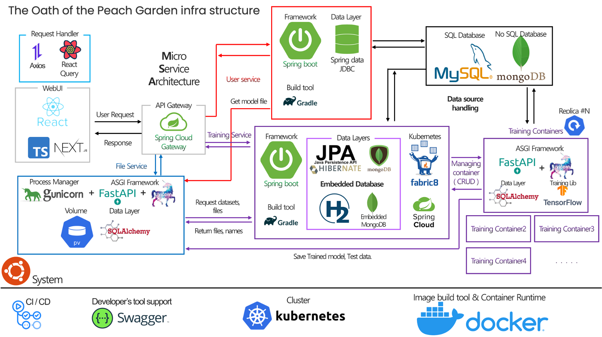

# Sketch-Brain Training Service

 

- KU 도원결의 팀 졸업프로젝트의 Training Service 를 담당하고 있는 Backend 입니다.
- Sketch-brain Backend M1
- 개발 기한 2022/10~2022/11 1month

## Design

---

- Kubernetes를 기반으로 MSA를 모방하여, **Service**를 분해하는 전략을 선택하였습니다.
- Service Discovery 는 Kubernetes 의 Service로 사용하고, 따로 Eureka Client 를 사용하지 않았습니다.

## Techs

---

### Database

- Database 는 Document-Type 의 NoSQL MongoDB 와, SQL Database 인 MySQL 두가지를 모두 사용합니다.
- Profile 설정을 각각 다르게 하여, Local Profile 인 경우에 SQL Database 는 H2 In-memory Database 를 이용하고, MongoDB 같은 경우는 [Embedded MongoDB](https://github.com/flapdoodle-oss/de.flapdoodle.embed.mongo) 를 사용합니다.
- Local 환경에서 Kubernetes 는 Mock library 를 사용해 모킹하여 사용합니다.

### etc

- 협업 툴로 Swagger, Devtool, Actuator 등을 제공하고, Front 와의 RestAPI 구현을 위해 Spring HATEOAS를 사용했습니다.
- DDD 계층화 아키텍처를 사용했습니다.
- CI/CD 는 Github Action 을 통해 build, 배포를 관리했습니다.

## Env

---

OpenJDK : Eclipse Termurin 11
